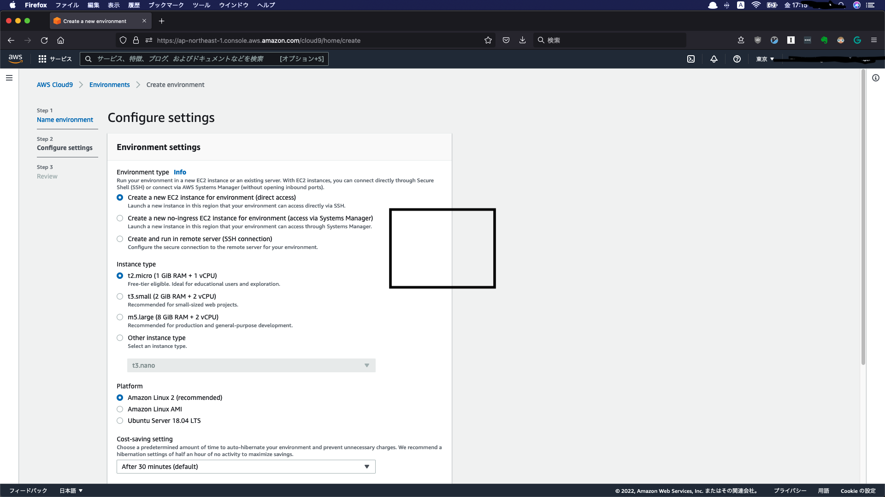
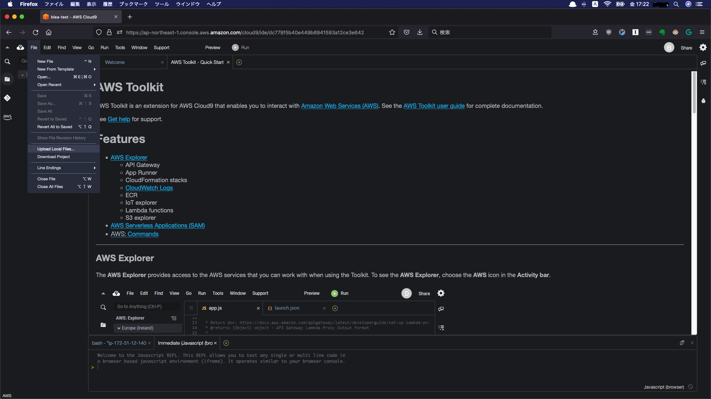
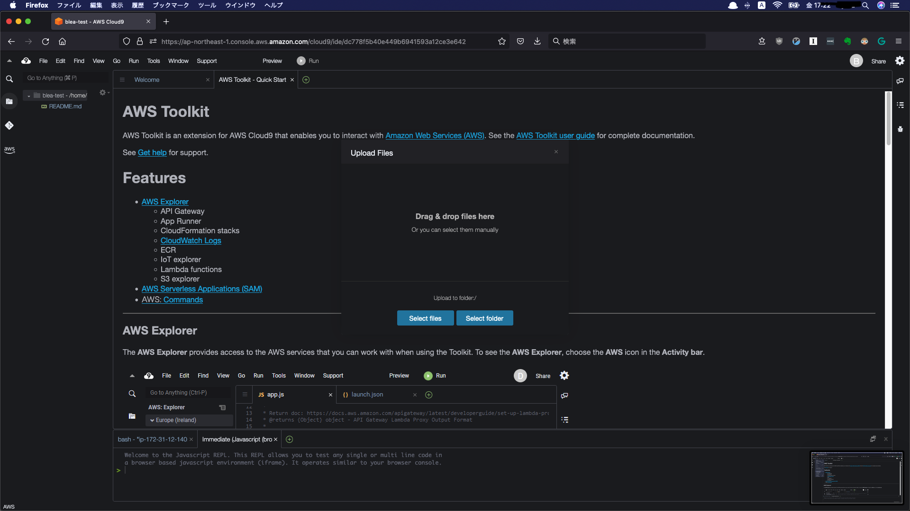
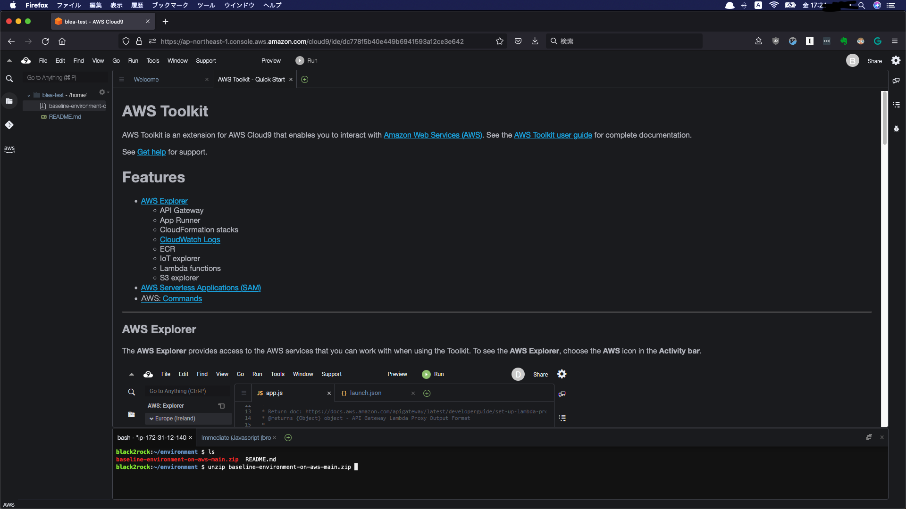
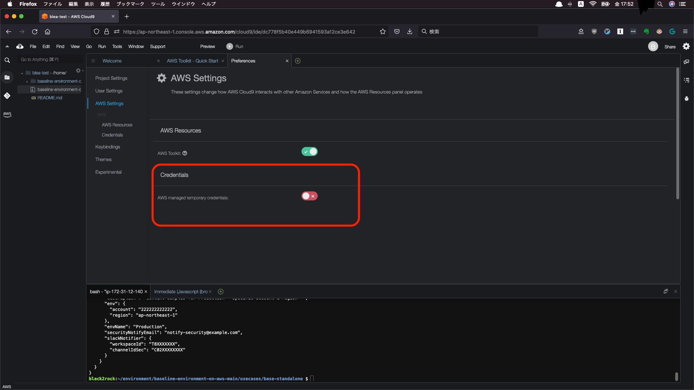
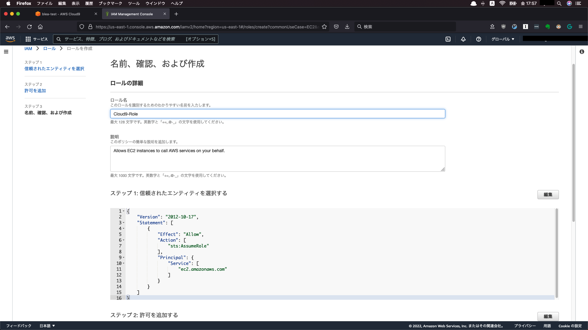
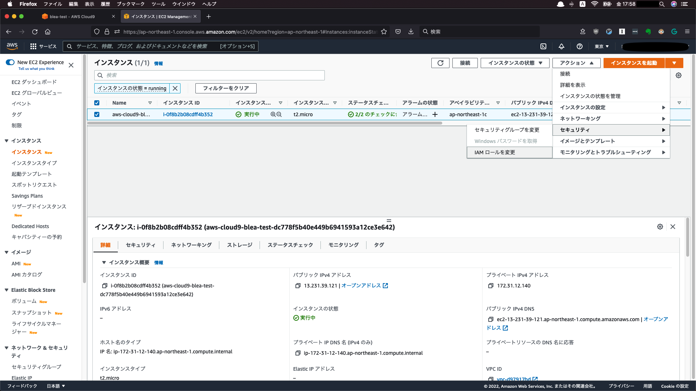
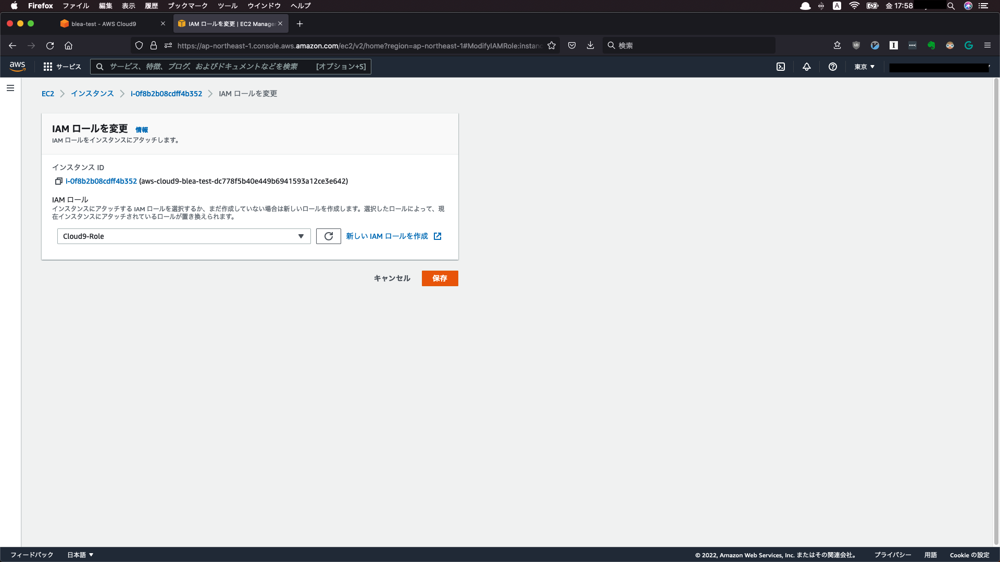
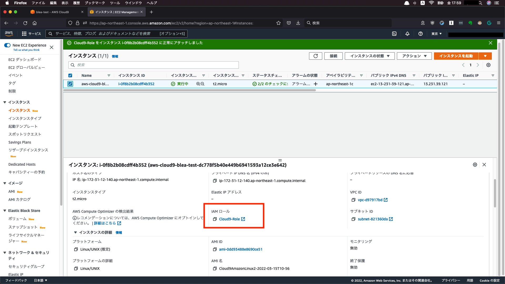
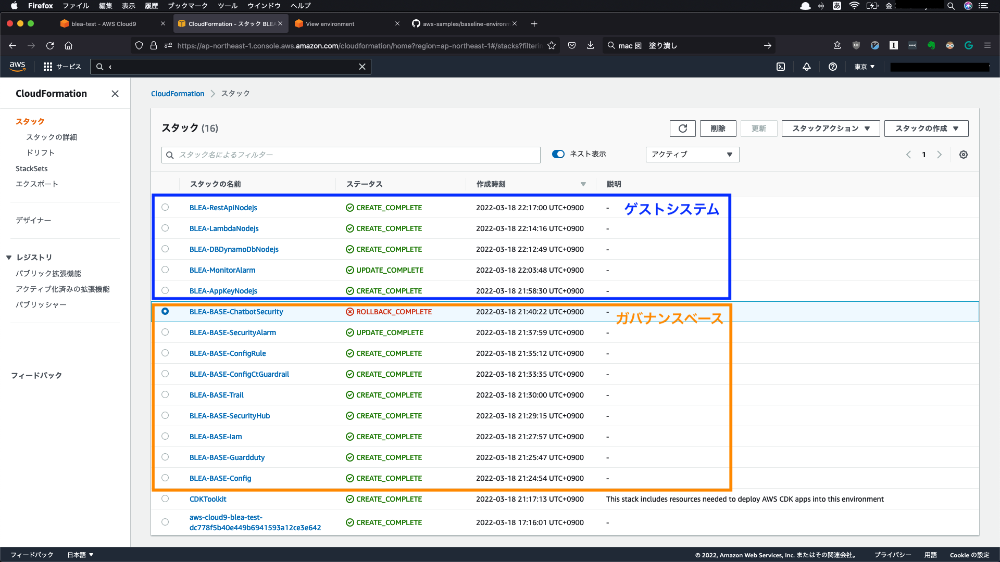

# AWS BLEA(Baseline Environment on AWS)を試してみた
[ガバメントクラウドにおけるIaC(Infrastructure as Code)の考え方 ](https://cloud-gov.note.jp/n/na2ea9a24e3a1)の記事で、デジタル庁のガバメントクラウドで、Infrastructure as Code(以降, IaC)テンプレートとしてガバナンスベースのテンプレートが使われると記載されており、「これってAWS BLEA(Baseline Environment on AWS)に近しいのでは？」と思い、試しに触ってみました。


## AWS BLEA(Baseline Environment on AWS)とは
> AWSのセキュリティのベストプラクティスを実装した環境を、迅速に実現するためのテンプレート  

とのこと。これだけだとフワッとしているので、もう少し具体的に記載すると、
[AWS 初心者向けハンズオン]([https://aws.amazon.com/jp/aws-jp-introduction/aws-jp-webinar-hands-on/?trk=aws_blog)の「Security #1 アカウント作成後すぐやるセキュリティ対策」で紹介されているようなAWSアカウントセットアップ時にまず最初にやるべきセキュリティ設定事項をCDKでサクッと設定できるもの、のようです。（例、CloudTrailの証跡作成、GuardDuty有効化、IAM Access Analyzer有効化など）

### AWS BLEAの特徴
- 単一のアカウントをセットアップする シングルアカウント版（Standalone）と、AWS Control Tower をベースとしたマルチアカウント環境をセットアップするマルチアカウント版がある
- 「ガバナンスベース (Governance Base)」と「ゲストシステム (Guest System)」のCDKテンプレートが提供されている 


引用；
[AWS環境にセキュアなベースラインを提供するテンプレート「Baseline Environment on AWS」のご紹介](https://aws.amazon.com/jp/blogs/news/announcing-baseline-environment-on-aws/)

詳細についてはAWSのブログ「[AWS環境にセキュアなベースラインを提供するテンプレート「Baseline Environment on AWS」のご紹介](https://aws.amazon.com/jp/blogs/news/announcing-baseline-environment-on-aws/)」をご確認ください。


## BLEAのシングルアカウント版（Standalone）を試してみる
様々な制約で「AWS Organizationsが使用できない」「AWS Organizationsの利用が前提となっているAWS Control Towerも使用できない」という場面があるため、AWS Control Towerを使わないで済むシングルアカウント版を試してみます。

### BLEAのテンプレートを眺めてみる
[シングルアカウント版のガバナンスベース](https://github.com/aws-samples/baseline-environment-on-aws/tree/main/usecases/base-standalone)やゲストシステムとして提供されているテンプレートの中身をナナメ読みすると、以下のようなテンプレートが提供されていることが確認できます。

| ガバナンスベース（シングルアカウント版）| ゲストシステム（Guest System） |
|---|---|
| ・Chatbotの設定　<br> ・AWS Configの設定 <br> ・GuardDuty有効化 <br> ・IAM設定まわり（ポリシー、ロールの作成など）　<br> ・Security Hubの設定 <br> ・CloudTrail証跡の作成 |　・[guest-apiapp-sample](https://github.com/aws-samples/baseline-environment-on-aws/tree/main/usecases/guest-apiapp-sample)（API Gateway+Lambda+DynamoDB構成） <br> ・[guest-webapp-sample](https://github.com/aws-samples/baseline-environment-on-aws/tree/main/usecases/guest-webapp-sample)（AWS ECS/Fargate構成）


引用；
[baseline-environment-on-aws](https://github.com/aws-samples/baseline-environment-on-aws)

上記から、AWSアカウントで最初に設定することが推奨されるAWS BudgetやCost Exploreを使用したコスト／請求周りの設定や、AWS Artifactを使用した準拠法／管轄裁判所（※）の変更までは、BLEAのガバナンスベースでは設定していないことがわかります。（※AWS アカウント開設直後では、AWS カスタマーアグリメントの準拠法及び管轄裁判所は米国の法律及び裁判所になっています）

特にデジタル庁のガバメントクラウド利用にあたっては、おそらく準拠法／管轄裁判所については、日本法／東京地方裁判所に変更することが求められると思います。また、ガバメントクラウドの調達条件として、[ISMAP](https://www.ismap.go.jp/csm?id=cloud_service_list)に登録されたクラウドサービスであることが前提となっているため、AWSの場合、東京／大阪リージョン以外は原則ガバメントクラウドでは使用できません。

そのため、ガバナンスベースのような共通設定のテンプレートにおいて、（出来るかどうかは確認が必要ですが）CDK経由での準拠法／管轄裁判所の変更や、IAMポリシーによるリージョンの制御（東京／大阪リージョン以外は使用禁止にする等）についても追加で実施した方が良さそうです。


### BLEAガバナンスベースを実行してみる
さて、前置きが長くなりましたがガバナンスベース（シングルアカウント版）を実行してみます。  
大まかな流れは[README](https://github.com/aws-samples/baseline-environment-on-aws#readme)の手順に従いますが、今回はCloud9の勉強も兼ねてCloud9経由でCDKを実行してみようと思います。

#### 手順
1. Cloud9のセットアップ
2. CDK実行環境セットアップ
3. CDKでデプロイpart1（ガバナンスベーステンプレートの適用）
4. CDKでデプロイpart2（ゲストシステムテンプレートの適用）
5. 後片付け

### 1. Cloud9のセットアップ
Cloud9のセットアップを実施します。デフォルト設定のまま作成を進めます。


まず[GitHub](https://github.com/aws-samples/baseline-environment-on-aws/archive/refs/heads/main.zip)から資材をローカル環境にダウンロードします。
ダウンロード完了したらCloud9にファイルをアップロードします。
[File]→[Upload Local Files...]を選択


Cloud9環境にダウンロードしたzipファイルをアップロードします。  
ドラック＆ドロップまたは「Select Files」でzipファイルをアップロードします。


zipファイルアップロード後、zipファイルを解凍します。
```
$ unzip /home/ec2-user/environment/baseline-environment-on-aws-main.zip 
```


手順に沿ってパッケージのインストールなどを実施します。
```
$ npm install -g npm
removed 17 packages, changed 70 packages, and audited 201 packages in 4s

10 packages are looking for funding
  run `npm fund` for details

$ npm fund
baseline-environment-on-aws@2.0.0

$ npm ci
added 897 packages, and audited 936 packages in 1m
70 packages are looking for funding
  run `npm fund` for details
found 0 vulnerabilities

// c9コマンド(Cloud9上でファイル編集が可能になるコマンド)が使えるようにインストール
$ npm install -g c9
$ c9 cdk.json
{
  "app": "npx ts-node bin/blea-base-sa.ts",　
  "context": {
    "dev": {
      "description": "Context samples for Dev - Anonymous account & region",
      "envName": "Development",
      "securityNotifyEmail": <任意のメールアドレスを設定>",
      "slackNotifier": { 　　　　　　　←通知先（Slack）の設定。今回はSlackへの通知はしないこととする
        "workspaceId": "T8XXXXXXX",　←値はこのままとするが、CDK実行時にエラーとなるため、bin/blea-base-sa.tsのChat箇所をコメントアウトしておく
        "channelIdSec": "C00XXXXXXXX"　←同上
      }
    },
    (中略)
      }
    }
  }
}
```

### 2. CDK実行環境セットアップ
続いてCloud9がCDKを実行できるようにアクセス権限の設定を実施します。
元の手順(README)では、~/.aws/credentialsにシークレットキー等の設定を直書きする手順となっていましたが、ここではIAMロールを使用した設定を行います。

Cloud9はデフォルトで、AWS Managed Temporary Credentials（以降、AMTC）が有効になっています。この設定が有効になっていることで、AWSマネジメントコンソールへログインしたユーザーと同等の権限をもつ一時クレデンシャルキーが自動で発行され、すぐにCloud9上のシェルでAWS CLIを利用可能になります。しかし、AMTCを使用する際にIAM等に対する一部のアクションが制限されているため、ガバメントベース適用時にIAM周りの設定に失敗すると思われます。そのため、Cloud9のAMTCを無効化し、IAMロールをCloud9(実体はEC2インスタンス)にアタッチします。

詳細については[クラスメソッドさんの記事](https://dev.classmethod.jp/articles/aws-cloud9-aws-managed-temporary-credentials/)が大変わかりやすく整理されていたためそちらをご確認ください。

[Cloud9のマーク]→[Preferrences]→[AWS Settings]→[AWS managed temporary credentials]を無効化します。


Cloud9のEC2インスタンスにアタッチするIAMロールを作成します。
IAMロールには、管理者権限（AdministratorAccess）ポリシーを割り当てます。


Cloud9のEC2インスタンスに作成したIAMロールを割り当てます。


IAMロールの割り当てが完了しました。


Cloud9上のターミナルでIAMロールが認識されているか確認します。
```
$ aws configure list
      Name                    Value             Type    Location
      ----                    -----             ----    --------
   profile                <not set>             None    None
access_key     ****************FFPK         iam-role    
secret_key     ****************2AyJ         iam-role    
    region                <not set>             None    None
```
アクセスキー及びシークレットキーがiam-roleのものを使用していることが確認出来ました。
リージョン情報については、環境変数で設定します。
```
$ export AWS_DEFAULT_REGION=ap-northeast-1
black2rock:~/environment/baseline-environment-on-aws-main/usecases/base-standalone $ aws configure list
      Name                    Value             Type    Location
      ----                    -----             ----    --------
   profile                <not set>             None    None
access_key     ****************FFPK         iam-role    
secret_key     ****************2AyJ         iam-role    
    region           ap-northeast-1              env    AWS_DEFAULT_REGION
```


以上でCloud9上でCDKを実行する環境が整いました。


### 3. CDKでデプロイpart1（ガバナンスベーステンプレートの適用）
```
$ cd usecases/base-standalone
$ npm run build
$ npx cdk deploy --all -c environment=dev --profile prof_dev
Need to perform AWS calls for account XXXXXXXXXX, but no credentials have been configured
```
手順に沿ってコマンド実行すると、上記のようなエラーが発生しました。cdk deployのオプションとして--profileを指定していますが、今回は~/.aws/credentialsを使用せずIAMロールを使用しているため、--profileを指定してしまうと、aws configure listコマンドの実行結果からも分かるとおり、profileは設定されていないため「no credentials have been configured」エラーとなってしまいます。

ということで、--profileオプションを外して再度コマンドを実行します。
```
$ npx cdk deploy --all -c environment=dev 
✨  Synthesis time: 14.38s

BLEA-BASE-Config
BLEA-BASE-Config: deploying...
[0%] start: Publishing 1f3d8bfff8e4ba170dce60ffe39edbbeba48be163bc219cb1279ce12c8cd436b:xxxxxxxxxxxx-ap-northeast-1
[100%] success: Published 1f3d8bfff8e4ba170dce60ffe39edbbeba48be163bc219cb1279ce12c8cd436b:xxxxxxxxxxxx-ap-northeast-1

 ✅  BLEA-BASE-Config (no changes)

✨  Deployment time: 0.52s

Stack ARN:
arn:aws:cloudformation:ap-northeast-1:xxxxxxxxxxxx:stack/BLEA-BASE-Config/6a7d0680-a6b6-11ec-bcf9-0a8e4f09946d

✨  Total time: 14.9s

BLEA-BASE-Guardduty
BLEA-BASE-Guardduty: deploying...
[0%] start: Publishing dec75cd78495daa84345fa2508f26be4530ba2b3d9f855262e1539a8831530f1:xxxxxxxxxxxx-ap-northeast-1
[100%] success: Published dec75cd78495daa84345fa2508f26be4530ba2b3d9f855262e1539a8831530f1:xxxxxxxxxxxx-ap-northeast-1

 ✅  BLEA-BASE-Guardduty (no changes)

(以下略)
```
無事、ガバナンスベースのCDKが実行できました。


### 4. CDKでデプロイpart2（ゲストシステムテンプレートの適用）
ガバナンスベースの実行が完了したため、続いてゲストシステムを実行してみようと思います。  
READMEではwebappのサンプルを実行していますが、ここではapiappのサンプルを実行しました。
```
cd guest-apiapp-sample/
px cdk deploy --all -c environment=dev
```

最終的に以下のようなCloudFormationスタックが作成されました。  
（Chatbotのスタック作成で失敗していますが、こちらはcdk.jsonの設定で既存パラメータのままCDKを実行したためになります）


### 5. お片付け
最後に環境の片付けを実施します。cdk destroyを使用してCloudFormationスタックを削除します。
```
$ cd guest-apiapp-sample/
$ npx cdk destroy --all -c environment=dev

$ cd guest-apiapp-sample/
$ npx cdk destroy --all -c environment=dev
```

## まとめ
デジタル庁のガバメントクラウドで、IaCテンプレートとしてガバナンスベースのテンプレートが使われると記載されていたためAWS BLEAを触ってみました。とりあえずガバナンスベース及びゲストシステムのBLEA(CDK)を実行することで、1日もかからずに一定のセキュリティ設定が施された環境が構築できるのは開発のアジリティ向上に大きく寄与すると思いました。

今回は一連の動作確認ということをメインで実施したため、ガバナンスベース／ゲストシステムで設定される各AWSリソースの細かい設定については確認出来ていないため、引き続き精査しつつ本記事でも少し触れたリージョンの制限や管轄裁判所の変更等、自分なりのガバナンスベースを作っていきたいな、と思いました。


## 参考
[ガバメントクラウドにおけるIaC(Infrastructure as Code)の考え方 ](https://cloud-gov.note.jp/n/na2ea9a24e3a1)

[AWSアカウントを作ったら最初にやるべきこと ～令和元年版～](https://dev.classmethod.jp/articles/aws-1st-step-new-era-reiwa/)

[CDK で AWS のセキュリティベストプラクティスに沿ったベースラインを展開できる Baseline Environment on AWS（BLEA）を触ってみた](https://dev.classmethod.jp/articles/aws-blea-audit/)

[Cloud9からIAM Roleの権限でAWS CLIを実行する](https://dev.classmethod.jp/articles/execute-aws-cli-with-iam-role-on-cloud9/)